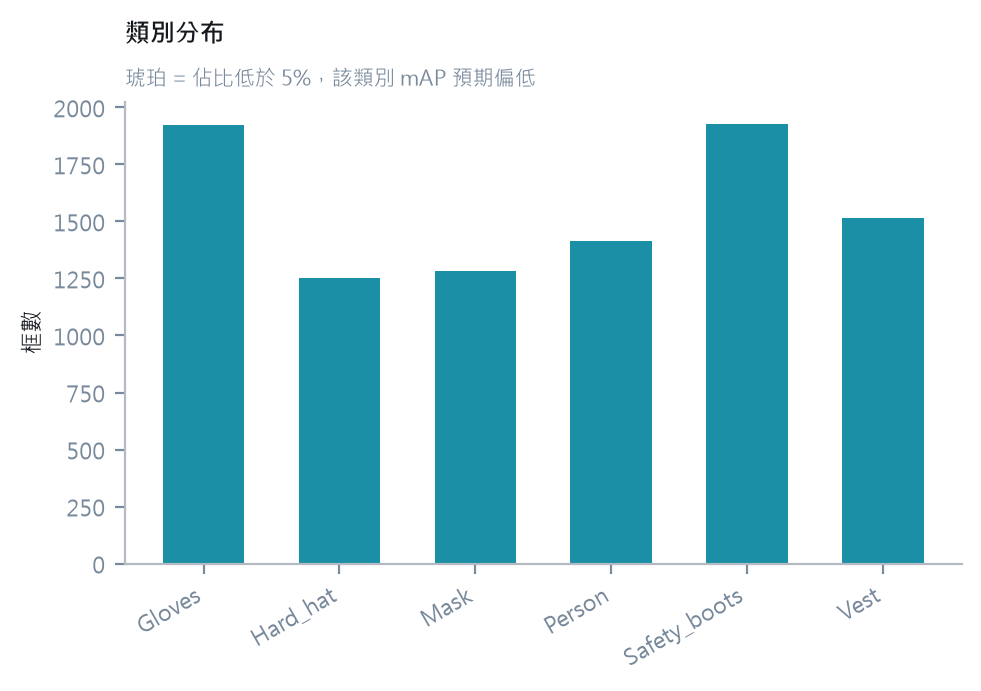
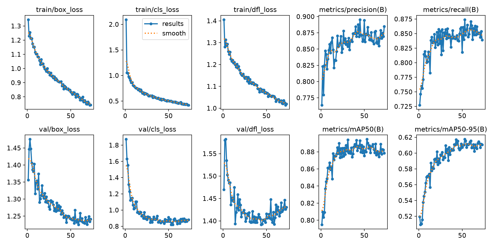
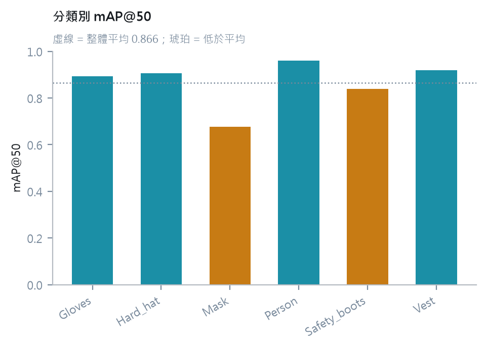
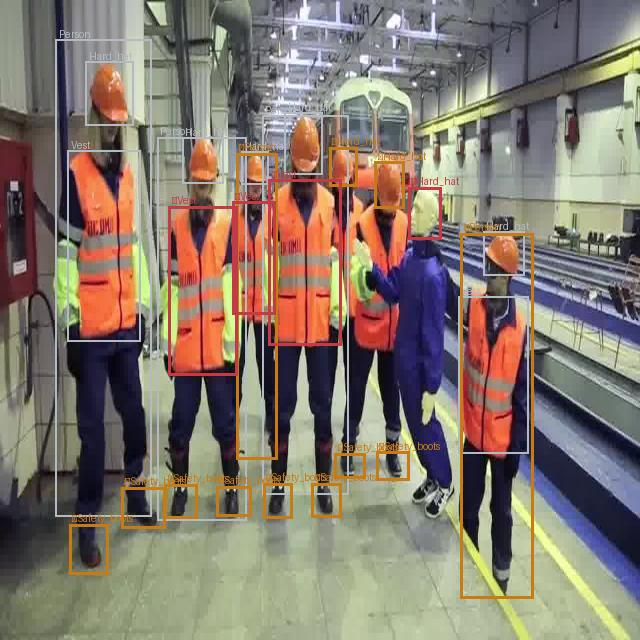
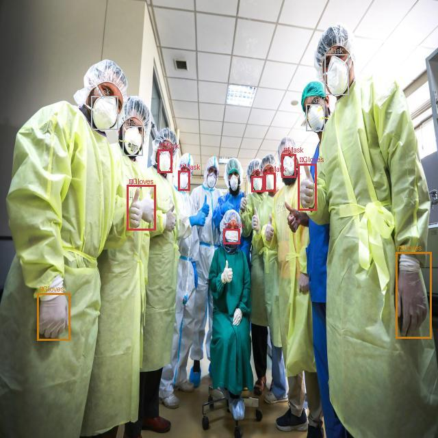
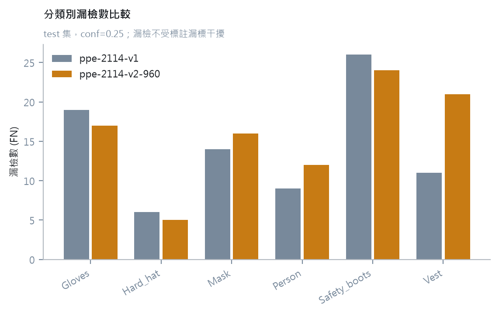
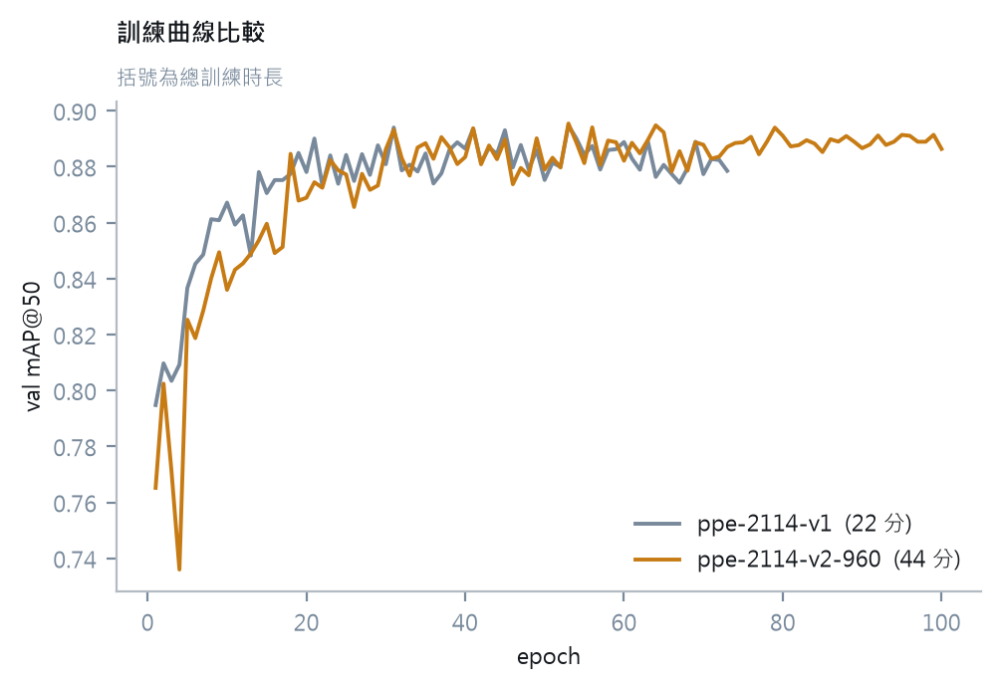

# 評估報告 —— PPE 偵測模型

> 資料集：PPE Detection（2,114 張 / 6 類，CC BY 4.0，作者 SDP）
> 模型：YOLOv8s fine-tune
> 日期：2026-08-10

---

## 摘要

在 2,114 張的 PPE 資料集上 fine-tune YOLOv8s，test 集 mAP@50 達 0.866。

**但這份報告的重點不是那個數字。** 三個發現比 mAP 更有價值：

| 發現 | 影響 |
|---|---|
| 誤報是漏檢的兩倍，但**成因因類別而異** | 不能用單一原因解釋，需逐張查證 |
| `Mask` 的誤報來自**標註漏標**；`Safety_boots` 的漏檢是**模型本身** | 兩者改善方向完全相反 |
| 提高輸入解析度的假設被**證偽** | 成本 +48%，mAP −0.011 |

**指標本身不會告訴你問題出在哪 —— 逐張查證才會。**

---

## 一、資料集

| 切分 | 影像 | 標註框 | 空標註 |
|---|---|---|---|
| train | 1,476 | 6,660 | 73 |
| val | 425 | 1,843 | 20 |
| test | 213 | 813 | 16 |

空標註共 109 張（5.2%），三個切分比例一致 —— 這是**負樣本**，正常且有益。

### 類別分布



| 類別 | train | 佔比 |
|---|---|---|
| Gloves | 1,387 | 20.8% |
| Safety_boots | 1,364 | 20.5% |
| Vest | 1,099 | 16.5% |
| Person | 948 | 14.2% |
| Hard_hat | 947 | 14.2% |
| Mask | 915 | 13.7% |

**六類介於 13.7%–20.8%，分布均衡。** 沒有任何類別樣本不足。

> 這與原規劃的預期不符。`docs/階段規劃.md` 預期 `Safety_boots` 會樣本偏少
> （「若 Person 有 5,000 個而 Safety_boots 只有 80 個」），實際上它是第二多的類別。
> **因此「樣本少導致 mAP 低」這個分析素材不存在** —— 類別間的差異必然來自別的原因。

### 框大小

| | P10 | 中位 | P90 |
|---|---|---|---|
| 相對面積 | 0.0035 | 0.0103 | 0.2158 |

**跨度超過 60 倍。** 小物件（Gloves、Mask）與大物件（Person）混在同一張影像 ——
這是偵測任務的經典難題，也是後續解析度實驗的動機。

### 標註格式

此資料集為**多邊形標註**（YOLO 分割格式），Ultralytics 訓練偵測模型時自動轉為外接框。

`dataset_stats.py` 原僅支援 bbox 格式，遇到此資料集直接 `ValueError`。
**Roboflow 頁面不會標示匯出格式** —— 下載新資料集後先跑統計，可提早發現這類差異。

---

## 二、訓練設定與成本

| | v1 | v2 |
|---|---|---|
| 模型 | YOLOv8s | YOLOv8s |
| **imgsz** | **640** | **960** |
| batch | 16 | 16 |
| epochs 上限 | 100 | 100 |
| patience | 20 | 20 |
| seed | 0 | 0 |
| **實際 epochs** | **73**（early stop） | **100**（未觸發） |
| **總時長** | **22 分** | **44.5 分** |
| **每 epoch** | **18 秒** | **26.7 秒** |

硬體：RTX 3080 12 GB、Xeon E5-2699 v4 ×2、128 GB RAM。全程本機訓練。

`imgsz` 是兩者唯一的設定差異。

---

## 三、v1 結果（imgsz 640）

### 訓練曲線



train 三項 loss 持續下降，val loss 跟隨並在後段走平，val mAP 上升後平穩。
**無過擬合徵兆** —— 過擬合的形態是 val loss 回升而 train loss 續降，此處未出現。

Early stopping 在 epoch 73 觸發，最佳權重約在 53。

### 模型能力（mAP，跨所有信心閾值）

| 類別 | test mAP@50 | test mAP@50-95 | 落差 |
|---|---|---|---|
| Person | 0.959 | 0.711 | 0.248 |
| Vest | 0.919 | 0.680 | 0.239 |
| Hard_hat | 0.906 | 0.671 | 0.235 |
| Gloves | 0.893 | 0.550 | **0.343** |
| Safety_boots | 0.839 | 0.517 | **0.322** |
| Mask | 0.676 | 0.407 | **0.269** |
| **整體** | **0.866** | **0.589** | |



**mAP@50 與 mAP@50-95 的落差分成兩群。** 大物件約 0.24，小物件約 0.32–0.34。

mAP@50 只要 IoU > 0.5 即算命中，mAP@50-95 要求貼合到 0.95。
落差大代表**模型找得到物件，但框畫得不夠準** —— 小框對位置誤差極度敏感：
佔畫面 20% 的 Person 偏 5 像素幾乎不影響 IoU，佔 0.35% 的 Gloves 偏 5 像素
IoU 可能從 0.9 掉到 0.5。

### 部署閾值下的表現（conf = 0.25）

此閾值與 `model-service` 的 `CONFIDENCE_THRESHOLD` 一致，反映線上實際行為。

| 類別 | TP | FP | FN | P | R |
|---|---|---|---|---|---|
| Gloves | 140 | 34 | 19 | 0.805 | 0.881 |
| Hard_hat | 82 | 18 | 6 | 0.820 | 0.932 |
| Mask | 78 | 42 | 14 | 0.650 | 0.848 |
| Person | 148 | 22 | 9 | 0.871 | 0.943 |
| Safety_boots | 153 | 36 | 26 | 0.810 | 0.855 |
| Vest | 127 | 28 | 11 | 0.819 | 0.920 |
| **合計** | **728** | **180** | **85** | **0.802** | **0.895** |

> **兩張表回答不同問題。** mAP 是模型的理論能力（跨所有閾值積分，定義固定、可跨實驗比較）；
> 上表是部署設定下的實際計數。mAP 表中的 P/R 取自各類別的最佳 F1 點，
> **取值閾值不固定，跨實驗不可直接比較**。

---

## 四、發現一：誤報與漏檢的成因因類別而異

失敗分析（`error_analysis.py`，conf = 0.25，test 集）：

| 類別 | 漏檢 | 誤報 | 誤報/漏檢 |
|---|---|---|---|
| Hard_hat | 4 | 22 | **5.5×** |
| Mask | 17 | 45 | 2.6× |
| Vest | 14 | 35 | 2.5× |
| Person | 10 | 24 | 2.4× |
| Gloves | 21 | 37 | 1.8× |
| Safety_boots | 31 | 34 | 1.1× |
| **合計** | **97** | **197** | **2.0×** |

誤報是漏檢的兩倍。**但檢視個別影像後，這個統計沒有單一成因。**

### 案例 A：密集工地 —— 模型漏檢



*灰 = 正確，琥珀 = 漏檢，紅 = 誤報*

```
標註組成： Counter({'Safety_boots': 8, 'Hard_hat': 7, 'Person': 5, 'Vest': 2})
標註 22 個 / 預測 14 個 / 正確 10 / 漏檢 12 / 誤報 4

漏檢： ['Safety_boots', 'Safety_boots', 'Safety_boots', 'Safety_boots',
       'Safety_boots', 'Safety_boots', 'Safety_boots', 'Safety_boots',
       'Person', 'Hard_hat', 'Hard_hat', 'Person']
誤報： ['Vest', 'Vest', 'Vest', 'Hard_hat']

誤報的框與最接近標註的 IoU：
  Vest           最高 IoU 0.38 (對 Person)
  Vest           最高 IoU 0.39 (對 Person)
  Vest           最高 IoU 0.33 (對 Person)
  Hard_hat       最高 IoU 0.00 (對 Vest)
```

**模型預測的數量少於標註**（14 < 22）。灰框集中在最左側最近、最清晰的人物，
中景那群人的物件多半沒被偵測到 —— 漏檢的 12 個中有 8 個是安全鞋。

**成因：密集場景 + 相互遮擋 + 小尺度。** 這與全域統計吻合
（`Safety_boots` 漏檢 31 個，六類最高）。

四個誤報分成兩類：三個 `Vest` 對最接近標註（`Person`）的 IoU 為 0.33–0.39 ——
背心穿在人身上，兩者高度重疊，而該圖 `Vest` 標註僅 2 個、畫面上明顯更多，
**此處存在小規模漏標**；一個 `Hard_hat` 的 IoU 為 0.00，是完全無對應標註的偵測。

與漏檢的 12 個相比，誤報不是這張圖的主要問題。

### 案例 B：醫療場景 —— 標註漏標



```
標註組成： Counter({'Mask': 4, 'Gloves': 2})
標註 6 / 預測 12 / 正確 4 / 漏檢 2 / 誤報 8

漏檢： ['Gloves', 'Gloves']
誤報： ['Mask', 'Mask', 'Mask', 'Mask', 'Mask', 'Mask', 'Gloves', 'Gloves']

誤報的框與最接近標註的 IoU：
  Mask     最高 IoU 0.00 (對 Mask)
  Mask     最高 IoU 0.00 (對 Mask)
  Mask     最高 IoU 0.00 (對 Mask)
  Mask     最高 IoU 0.00 (對 Mask)
  Mask     最高 IoU 0.00 (對 Mask)
  Mask     最高 IoU 0.00 (對 Mask)
  Gloves   最高 IoU 0.00 (對 Mask)
  Gloves   最高 IoU 0.00 (對 Mask)
```

畫面中十餘人配戴口罩，**標註僅有 4 個**。模型偵測到 10 個口罩，
其中 4 個對上標註，其餘 6 個被計為誤報。

**IoU 全部為 0.00 是關鍵。** 若是定位不準，數值會落在 0.2–0.4；
歸零代表那些位置**完全沒有標註**。漏標成立。

同時 2 個 `Gloves` 漏檢、2 個 `Gloves` 誤報，後者的 IoU 同樣為 0.00 ——
手套的標註也不完整。白色手套與淺色防護衣同色且體積小，是漏檢的成因。

### 結論

| 類別 | 主要成因 | 改善方向 |
|---|---|---|
| Mask 誤報 45 | **標註漏標** | 修資料 |
| Safety_boots 漏檢 31 | **模型漏檢**（密集、小、遮擋） | 改訓練 |
| Vest 誤報 35 | 部分漏標 + 與 Person 邊界重疊 | 待進一步查證 |

**「誤報是漏檢的兩倍」不能用單一原因解釋。** 逐張查證前，任何解釋都只是猜測。

> **方法上的教訓**：本節初稿曾僅憑統計數字推論成因，並挑選符合該推論的影像佐證，
> 結論與實測數據不符。指標指出「哪裡不對」，唯有逐張比對標註與預測才能得知「為什麼」。

---

## 五、發現二：Mask 的低 mAP 主要是資料問題

`Mask` 的 test mAP@50 為 0.676，六類最低，且較 val（0.797）下降 0.12。

由案例 B 可知，其 45 個誤報中相當比例來自標註漏標 ——
模型偵測到的口罩位置正確，但標註缺失，IoU = 0.00。

**這意味著 `Mask` 的實際表現優於 0.676**，而 precision（0.650，六類最低）
被系統性低估。

同時它仍有 17 個漏檢，那部分是模型本身的限制。

> 若僅閱讀 mAP 數字，會做出「Mask 最需要改善模型」的判斷。
> 實際上該投入的是**標註品質**。兩者的成本與作法完全不同。

### 對後續實驗的影響

| 指標 | 受漏標影響 | 可用於對照實驗 |
|---|---|---|
| FP（誤報） | **嚴重** | ✗ |
| precision | **嚴重** | ✗ |
| mAP | 中等 | ⚠️ 需註明 |
| **FN（漏檢）** | **不受影響** | ✅ |

FN 是「標註有、模型沒抓到」—— 漏標不會製造 FN。
**因此第六節的對照實驗以 FN 為判準。**

---

## 六、發現三：解析度假設被證偽

### 假設

> `Gloves` 的漏檢來自輸入解析度不足。框的 P10 相對面積為 0.0035，
> 在 640 輸入下約 30–40 像素。提高至 960 後，小物件類別的漏檢應明顯改善，
> 大物件（Person、Vest）幾乎不變。
>
> **證偽條件**：若六類都改善或都不改善，假設不成立。

### 結果（test 集，conf = 0.25）



*灰 = v1 (640) 基準，琥珀 = v2 (960)*

| 類別 | v1 FN | v2 FN | 變化 |
|---|---|---|---|
| Gloves | 19 | 17 | −2 |
| Hard_hat | 6 | 5 | −1 |
| Mask | 14 | 16 | +2 |
| Person | 9 | 12 | +3 |
| Safety_boots | 26 | 24 | −2 |
| **Vest** | **11** | **21** | **+10** |
| **合計** | **85** | **95** | **+10** |

| 指標 | v1 (640) | v2 (960) | 變化 |
|---|---|---|---|
| test mAP@50 | 0.866 | 0.855 | **−0.011** |
| test mAP@50-95 | 0.589 | 0.585 | −0.004 |
| 每 epoch | 18 秒 | 26.7 秒 | **+48%** |
| 總時長 | 22 分 | 44.5 分 | +102% |
| GPU 推論 | 5.2 ms | 5.8 ms | +12% |

> 訓練日誌中「最後一個 epoch 的 val mAP@50」為 v1 0.879、v2 0.886 —— 方向與上表相反。
> 那是**最後一輪**的驗證值，而 `best.pt` 取的是最佳輪次；結論依據為 test 集的獨立評估。

### 判定：**假設不成立**

`Gloves` 的漏檢僅減少 2 個（159 個實例中的 1.3%，雜訊範圍）。
漏檢總數不降反升，且惡化幾乎全部來自 `Vest`（+10）—— 那是大物件，
與解析度假設完全無關。

**640 對此資料集已足夠。瓶頸不在輸入解析度。**

這也與第四節的發現一致：`Safety_boots` 的漏檢來自密集場景的遮擋，
`Mask` 的誤報來自標註缺失 —— **兩者都不是提高像素能解決的問題。**

### 對照的一個瑕疵

v2 跑滿 100 epochs 未觸發 early stopping，v1 在 73 停止。
訓練輪次因此不同，構成殘餘變因。



兩條曲線在 epoch 20 之後幾乎完全重疊。**v2 多跑了 27 個 epoch，
val mAP 並未因此爬得更高** —— 更高的解析度讓收斂略慢，但收斂到同一個水準。

**此瑕疵不推翻結論** —— v2 訓練得更久卻表現更差，若消除此變因結論只會更強。

---

## 七、換模型的實際成本

訓練與部署分屬兩個 repo，介面是**一個 `.pt` 檔加兩個環境變數**：

```
runs/detect/ppe-2114-v1/weights/best.pt
    ↓ export_to_service.py
vision-detect/model-service/weights/
    ↓ 編輯 .env 兩行
MODEL_WEIGHTS=/app/weights/ppe-2114-v1.pt
MODEL_VERSION=ppe-2114-v1
    ↓
docker compose up -d --force-recreate model
```

C#、Vue、MAUI 完全不動。可行性驗證階段已實測通過（COCO → 3 類自訓練模型）。

> **可行性驗證同時發現該流程原本不成立**：`docker-compose.yml` 的 volume 掛載
> 被註解、`MODEL_WEIGHTS` 未傳入容器。Python 端早已支援，缺的僅是配置。
> 修補範圍三行。詳見 `reports/smoke-report.md`。

**推論效能註記**：本報告的 5.2 ms 為 GPU 推論。`model-service` 使用 CPU 推論，
延遲量級不同，不可直接比較。

---

## 八、結論與後續

### 已確認

1. YOLOv8s 在此資料集上 test mAP@50 = 0.866，六類均衡，無過擬合。
2. 誤報與漏檢的成因因類別而異：`Mask` 的誤報主要來自標註漏標，
   `Safety_boots` 的漏檢來自密集場景的遮擋與尺度。
3. 提高輸入解析度至 960 無效，且成本增加 48%。

### 未做

**未量化漏標的整體規模。** 目前僅確認兩張影像存在漏標，
未統計 213 張 test 集中的比例。**因此「precision 被低估」的程度無法量化。**

若要量化，可行的作法是抽樣 20–30 張，人工核對標註與預測，
統計「IoU = 0 的誤報」佔全部誤報的比例。這超出本階段範圍。

**未嘗試修正標註。** 補標 2,114 張不在本階段範圍內。

**未比較其他架構。** RF-DETR 等較新架構可能更好，但現有流程的價值在於分析方法，
不在於使用最新模型。架構比較適合作為獨立實驗。

### 若要繼續改善，優先順序

| 順序 | 作法 | 理由 |
|---|---|---|
| 1 | 抽樣量化漏標比例 | 決定後續投資方向的前提 |
| 2 | 針對密集/遮擋場景補資料 | `Safety_boots` 的漏檢是真實的模型限制 |
| 3 | 調整超參數 | 解析度已證偽；其餘參數的預期效益低於前兩項 |

### 方法上的收穫

| 項目 | 說明 |
|---|---|
| 統計要在訓練前跑 | 類別分布、框大小、標註格式都影響後續怎麼讀結果 |
| 兩種閾值分開報告 | mAP 是理論能力，固定 conf 是線上行為 |
| 對照實驗要有證偽條件 | 沒有證偽條件的實驗，任何結果都能事後解釋 |
| 負面結果是有效結果 | 排除一個假設，等於縮小了問題範圍 |
| **不能從統計反推成因** | 本報告第四節初稿即因此出錯，修正後才與數據相符 |
| **IoU = 0 與 IoU ≈ 0.3 意義完全不同** | 前者是標註缺失，後者是定位不準 |

---

## 附錄 · 復現方式

```powershell
# 環境
.\.venv\Scripts\python.exe check_env.py

# 資料集統計
.\.venv\Scripts\python.exe dataset_stats.py datasets\ppe-2114\data.yaml `
    --out reports\figures\ppe-2114-classes.png

# 訓練
.\.venv\Scripts\python.exe train.py configs\ppe.yaml
.\.venv\Scripts\python.exe train.py configs\ppe-960.yaml

# 評估
.\.venv\Scripts\python.exe evaluate.py runs\detect\ppe-2114-v1\weights\best.pt --split test
.\.venv\Scripts\python.exe evaluate.py runs\detect\ppe-2114-v2-960\weights\best.pt --split test

# 失敗分析
.\.venv\Scripts\python.exe error_analysis.py runs\detect\ppe-2114-v1\weights\best.pt

# 跨實驗比較
.\.venv\Scripts\python.exe compare_runs.py ppe-2114-v1 ppe-2114-v2-960
```

### 單張影像的逐框查證

第四節的數據來自此指令。**分析個別影像時，這比看圖更可靠** ——
IoU 數值能區分「標註缺失」（0.00）與「定位不準」（0.2–0.4）。

```powershell
.\.venv\Scripts\python.exe -c "
from pathlib import Path
from PIL import Image
from collections import Counter
import error_analysis as E
from ultralytics import YOLO

names = ['Gloves','Hard_hat','Mask','Person','Safety_boots','Vest']
img = Path('datasets/ppe-2114/test/images/<檔名>.jpg')
w, h = Image.open(img).size
gts = E.parse_label(Path(str(img).replace('images','labels')).with_suffix('.txt'), w, h)
r = YOLO('runs/detect/ppe-2114-v1/weights/best.pt').predict(img, conf=0.25, verbose=False)[0]
preds = [(int(c), *map(float, xy)) for c, xy in zip(r.boxes.cls.tolist(), r.boxes.xyxy.tolist())]
ok, fn, fp = E.match(gts, preds)
print('標註組成：', Counter(names[g[0]] for g in gts))
print(f'標註 {len(gts)} / 預測 {len(preds)} / 正確 {len(ok)} / 漏檢 {len(fn)} / 誤報 {len(fp)}')
print('漏檢：', [names[gts[i][0]] for i in fn])
print('誤報：', [names[preds[i][0]] for i in fp])
for i in fp:
    b = max((E.iou(g[1:], preds[i][1:]), names[g[0]]) for g in gts)
    print(f'  {names[preds[i][0]]:<14} 最高 IoU {b[0]:.2f} (對 {b[1]})')
"
```

`<檔名>` 換成 `error_analysis.py` 排名輸出的檔名。

資料集來源與授權見 `docs/SOURCES.md`。本資料集採 CC BY 4.0，引用需署名 SDP。